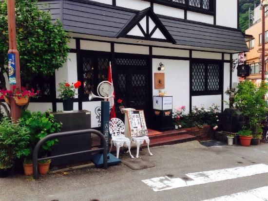

# Plan

st=>start
e=>end
io01=>inputoutput: ウナギたべる@うな:>[a][l001]
op01=>operation: ホテルつく
op02=>operation: おんせいんはいる
io02=>inputoutput: たべる@河鹿
st->io01->op01->io02->e

### [カフェモーツァルト][l001]

基本情報  |  a
--|--
  |  sss
エリア  |  

<a href="blog.html"># Back</a>

[l001]:https://tabelog.com/toyama/A1602/A160201/16000182/ "カフェモーツァルト"
[l001]:https://tabelog.com/toyama/A1602/A160201/16000182/ "カフェモーツァルト"
